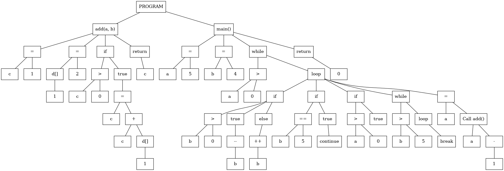
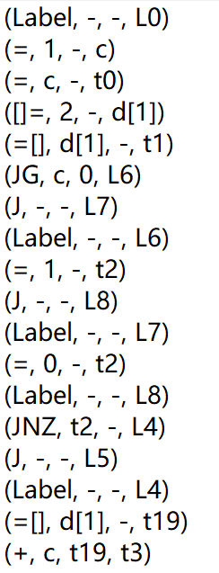
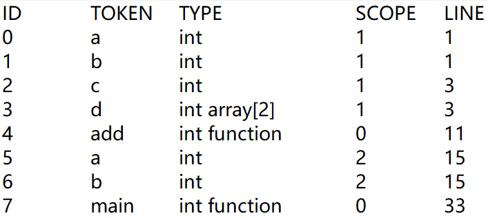

<h1 align = "center">西北工业大学 编译原理实验 MiniC编译器前端 </h1>  

写给将来的我自己（如果还会看的话，其实不会了，写的实在烂）或者以后的同学（好像有点可能）。**有用请点个星星，谢谢！**

## 使用
### 系统要求
安装有flex, bison和graphviz软件并具有c++编译环境的Linux系统中  
（我是在Windows WSL中的Ubuntu20.04里做的，这个要装flex, bison的话用“sudo apt-get install flex bison”命令，
要安gcc的话应该是用"sudo apt-get install build-essential"命令吧，反正记得有点坑）
### 编译
```
make
```
产生出的可执行文件为compiler_haotian  
（这个是有点问题的，make的依赖没有弄明白怎么自动生成，每一个单独写又太麻烦了，所以一些文件变化时另一些自动重新编译是做不到了，可能会有奇怪报错，所以需要make clean后重新make）
### 运行
```
./compiler_haotian 代码文件
```
或
```
sh test.sh additional|basic|error|optional
```
可以分别运行单个文件和运行miniC_test_cases中的基本、附加、错误、可选测试
（其实这个没什么用，大概只肯定能过基本测试、勉强能过错误测试产生点报错（没太注意报错），剩下的就很难或基本不行了）
### 调试
common.h头文件中如果不注释#define DEBUG可以输出一些调试信息帮助找错

### 输出结果
抽象语法树  
  
四元式  
<div align="center">
	
</div>  
符号表  
<div align="center">
	
</div>

## 问题
同名变量作用域不能重叠，很难解决，不过基本要求也没有嘛。  
一维数组翻译不完整，解决比较麻烦，因为赶时间而且等号左右翻译结果有点麻烦，就没再从Variable继承出数组结点，具体看SynTree/Op那里吧，要改需要重新写一下，懒得再弄了。  
无法翻译二维及以上数组等，很难解决，文法倒是好改，但语法树节点加上这个比较麻烦，最后赶时间写的代码更大大加剧了难度。  

## 修改建议
&emsp;&emsp;不建议修改……写这玩意儿的时候还没学过C++，照着Java凑合的，拷贝移动赋值构造、智能指针什么的全部没有。然后结束后再回顾设计有很多不合理的地方，比如Terminal没有继承Expr、各个类保存的信息很不统一、gen_ir()等函数的参数、返回值不适合进行函数调用等，反正很多地方，而且牵扯的地方太多都不太好改了。  
&emsp;&emsp;如果确实要修改的话，推荐从git里找前几个版本，到翻译函数调用、数组部分之前。后面这些时间太赶了，基本是能用就行，所以代码根本没法看了。  
&emsp;&emsp;当然，更建议作为参考，比如我觉得SynNode继承分为Stmt和Expr（虽然是从课本里给的代码学来的），还有gen_graph()调用get_node_content()什么的一些部分设计的还是挺好的。

## 抽象语法树、符号表类间继承关系
### SynTree部分
                                     SynNode            
       _________________________________|____________________________________  
      |                  |                          |                        |  
    Block              Stmt                       Expr                   Terminal  
      |    ______________|_______________      _____|_____          _________|_________  
      |   |   |    |     |       |       |    |   |       |        |        |          |  
    Func If Else While Break Continue Return Op Unary FuncCall Variable Constant TempVariable  
### SynTree部分其他
    SynTree Operator SynTreeException
### SymTable部分
           Type       
         ____|___     
        |        |    
    TypeFunc TypeArray
### SymTable部分其他
    SymTable SymTableException
### 各部分用途
太麻烦，不太想写了，望类名生义吧，注释也可以凑合看看。

## 词法、语法和主程序等文件
    lexel.l LexerException.h LexerException.cpp                     词法分析及相应异常  
    parser.y help.h help.cpp ParserException.h ParserException.cpp  语法分析和辅助文件及相应异常  
    QuadTable.h QuadTable.cpp                                       四元式表  
    main.cpp                                                        主程序  

## 思路及函数说明
要写起来内容很多，但实验结束实在太疲惫，不想碰代码，随便说说吧。
### 思路
在lexer.y中进行词法分析，在parser.y中进行语法分析进而生成符号表和抽象语法树，最后遍历抽象语法树生成四元式  
词法分析，这个主要比较零碎了，函数、变量定义部分用了一些定义在help.h中的结构体传需要的参数，然后填写符号表  
在表达式、语句等的产生式归约过程中产生新的节点并连接，最终形成一颗树抽象语法树，主要讲讲把树画出来的函数和生成四元式函数吧。  
### 函数说明
#### gen_graph()
用途：生成.dot文件在之后可以调用graphviz软件产生图  
实现：首先调用emit_node()和emit_link()函数，产生当前节点和当前节点和前驱节点的连线（这个是少有的我觉得设计很
      满意的地方），这一步是在SynNode::gen_graph()中完成之后再根据子节点的不同，用不同方式遍历子节点。
      总而言之，深度优先搜索。  
#### gen_ir()
用途：在QuadTable对象中添加由本节点产生的新的四元式  
实现：同样是深度优先搜索，不同在于对函数返回值进行了利用。返回了指向Terminal对象的指针，这个是子节点四元式产
      生的值，比如a = b + 1; 翻译为(+, b, 1, t1) (=, t1, -, a) (=, a, -, t2)，这个Terminal对象的指针调
      用to_string()函数返回值就是t2，当然常量、变量就返回的是自身了，具体看代码理解吧。要额外说明的地方是，
      做数组部分的时候，只有最后一天了，就没把数组变量从Variable类里面继承出来，所以在Op类中翻译的时候就很
      混乱，尤其是相同的部分都没弄出个函数来。

## 经验教训
&emsp;&emsp;一定要做好充足的规划！！！  
&emsp;&emsp;我是想了一天多就开始做，当初实在没想到这事情要干一个多月，所以很多部分最开始划分的就有问题。应该至少计划四五天吧，功能分的详细一点，到底需要哪些类（弄明白所有可能需要的类，这个后面再添太影响整体设计了）、每个类都需要什么函数、类与类之间的接口（其实就是函数名了，没那么高级），还有类与类的继承关系想明白。总而言之，这程序到最后确实趋于崩溃状态，行数太多还是有点超出我现在的能力范围（尤其是开始时错误的以为只要大概2000行就能搞定，最后整出来快4000），确实是《软件工程》课上讲的失败典型。  
&emsp;&emsp;当然，还是很有成就感的，亲手把自己的设想实现，完成了最开始可以说无从下手的任务。不过，过程还是挺痛苦的，看着大概五点钟西工大慢慢变亮差不多要有十次了，但最后弄出来的时候，是真的开心，有些找回我初二时候第一次写出hello world的，初心吧。  
&emsp;&emsp;补充，这东西至少能在简历上占个位置，虽然没人感兴趣，但毕竟好大一张A4纸。另外，还是觉得应该去字节，真的考不上学啊😭

## 广告植入
&emsp;&emsp;还在为考研而发愁吗？还在为文凭而焦虑吗？不要360，不要350，更不要340，只要299，299！**中国科学院大学信息工程研究所**近五年分数线为290、国家线、国家线、300和284，均未超过300！
<div align="center">
	
</div>  
&emsp;&emsp;说正经的，如果考不到320，这个是最好的选择，因为没得选；如果能考到340，不值得。问题很多，知乎搜一下你懂的。看觉得无痛的考研体验和国科大毕业证（据说挺多时候能当985的用）值多少了。